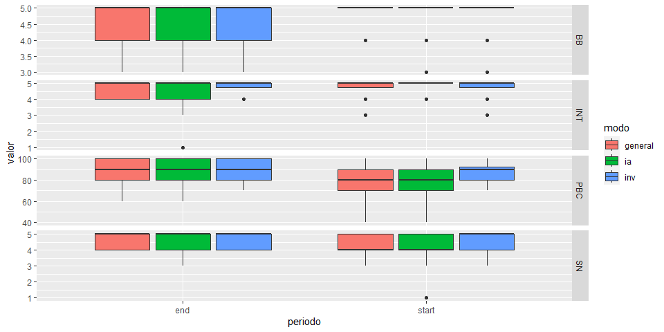
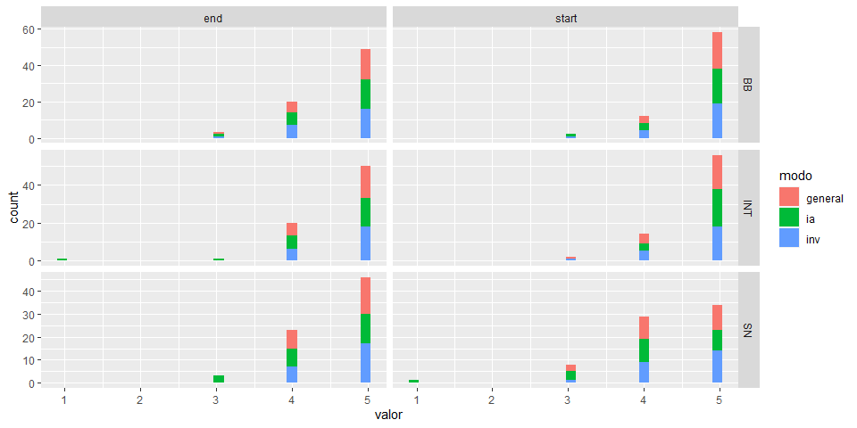
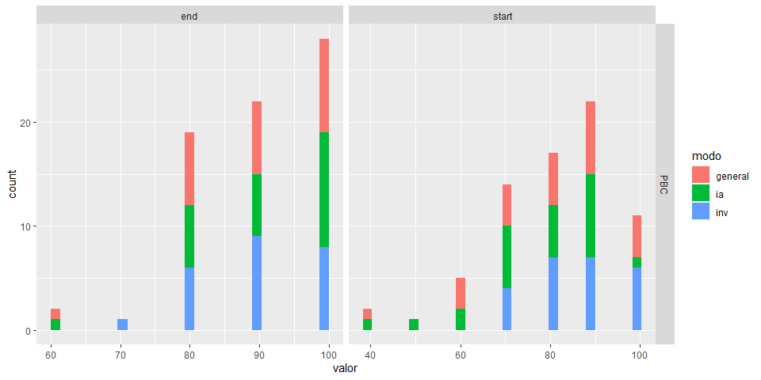

## Introducción

Este documento es una extensión de la investidación *Promoting
Engagement in Computing Research for Non-CS Majors* sobre el evento
ExploreCSR primera edición 2023 elaborado en la universidad ESPOL.

## Experimento

## Análisis Exploratorio de datos

el CSV *filtered_data.csv* presenta un resumen de los resultados
obtenidos en ambas encuestas realizadas. Este documento presenta las
siguientes columnas:

-   **matricula**: identificador único del estudiante
-   **variable**: Tipo de variable: INT, SN, BB, PBC.
-   **modo**: modo de agrupación: inv (investigación), ia (inteligencia
    artificial) y general (inv & ia)
-   **periodo**: tipo de encuesta realizada: start (encuesta inicio
    evento) y end (encuesta final evento)
-   **valor**: moda obtenida de la agrupación (depende del modo y la
    variable)

``` r
data <- read.csv("datos/filtered_data.csv", col.names = c("matricula","variable","modo","periodo","valor"))

# Muestra el resumen de un data frame
summary(data)
```

    ##    matricula           variable             modo             periodo         
    ##  Min.   :201404282   Length:576         Length:576         Length:576        
    ##  1st Qu.:201779668   Class :character   Class :character   Class :character  
    ##  Median :201857022   Mode  :character   Mode  :character   Mode  :character  
    ##  Mean   :201865877                                                           
    ##  3rd Qu.:202005715                                                           
    ##  Max.   :202208351                                                           
    ##      valor       
    ##  Min.   :  1.00  
    ##  1st Qu.:  5.00  
    ##  Median :  5.00  
    ##  Mean   : 24.89  
    ##  3rd Qu.: 13.75  
    ##  Max.   :100.00

``` r
ggplot(data, aes(x = periodo, y = valor, fill = modo)) +
  geom_boxplot() +
  facet_grid(variable ~ ., scales = "free_y")
```



``` r
ggplot(data[!(data$variable == "PBC"),], aes(x = valor, fill = modo)) +
  geom_histogram() +
  facet_grid(variable ~ periodo, scales = "free")
```

    ## `stat_bin()` using `bins = 30`. Pick better value with `binwidth`.



``` r
ggplot(data[(data$variable == "PBC"),], aes(x = valor, fill = modo)) +
  geom_histogram() +
  facet_grid(variable ~ periodo, scales = "free")
```

    ## `stat_bin()` using `bins = 30`. Pick better value with `binwidth`.



## Wilcoxon paired test

### Variable Intention (INT)

``` r
data_general = data[(data$variable == "INT" & data$modo == "general"),]

group_by(data_general, periodo) %>%
  summarise(
    count = n(),
    median = median(valor, na.rm = TRUE),
    IQR = IQR(valor, na.rm = TRUE)
  )
```

    ## # A tibble: 2 × 4
    ##   periodo count median   IQR
    ##   <chr>   <int>  <dbl> <dbl>
    ## 1 end        24      5  1   
    ## 2 start      24      5  0.25

``` r
res <- wilcox.test(valor ~ periodo, data = data_general, paired = TRUE)
```

    ## Warning in wilcox.test.default(x = DATA[[1L]], y = DATA[[2L]], ...): cannot
    ## compute exact p-value with ties

    ## Warning in wilcox.test.default(x = DATA[[1L]], y = DATA[[2L]], ...): cannot
    ## compute exact p-value with zeroes

``` r
print(res)
```

    ## 
    ##  Wilcoxon signed rank test with continuity correction
    ## 
    ## data:  valor by periodo
    ## V = 18, p-value = 1
    ## alternative hypothesis: true location shift is not equal to 0

``` r
data_inv = data[(data$variable == "INT" & data$modo == "inv"),]

group_by(data_inv, periodo) %>%
  summarise(
    count = n(),
    median = median(valor, na.rm = TRUE),
    IQR = IQR(valor, na.rm = TRUE)
  )
```

    ## # A tibble: 2 × 4
    ##   periodo count median   IQR
    ##   <chr>   <int>  <dbl> <dbl>
    ## 1 end        24      5  0.25
    ## 2 start      24      5  0.25

``` r
res <- wilcox.test(valor ~ periodo, data = data_inv, paired = TRUE)
```

    ## Warning in wilcox.test.default(x = DATA[[1L]], y = DATA[[2L]], ...): cannot
    ## compute exact p-value with ties

    ## Warning in wilcox.test.default(x = DATA[[1L]], y = DATA[[2L]], ...): cannot
    ## compute exact p-value with zeroes

``` r
print(res)
```

    ## 
    ##  Wilcoxon signed rank test with continuity correction
    ## 
    ## data:  valor by periodo
    ## V = 25, p-value = 0.7897
    ## alternative hypothesis: true location shift is not equal to 0

``` r
data_ia = data[(data$variable == "INT" & data$modo == "ia"),]

group_by(data_ia, periodo) %>%
  summarise(
    count = n(),
    median = median(valor, na.rm = TRUE),
    IQR = IQR(valor, na.rm = TRUE)
  )
```

    ## # A tibble: 2 × 4
    ##   periodo count median   IQR
    ##   <chr>   <int>  <dbl> <dbl>
    ## 1 end        24      5     1
    ## 2 start      24      5     0

``` r
res <- wilcox.test(valor ~ periodo, data = data_ia, paired = TRUE)
```

    ## Warning in wilcox.test.default(x = DATA[[1L]], y = DATA[[2L]], ...): cannot
    ## compute exact p-value with ties

    ## Warning in wilcox.test.default(x = DATA[[1L]], y = DATA[[2L]], ...): cannot
    ## compute exact p-value with zeroes

``` r
print(res)
```

    ## 
    ##  Wilcoxon signed rank test with continuity correction
    ## 
    ## data:  valor by periodo
    ## V = 3.5, p-value = 0.04033
    ## alternative hypothesis: true location shift is not equal to 0

### Perceived Behavioral Control (PBC)

``` r
data_general = data[(data$variable == "PBC" & data$modo == "general"),]

group_by(data_general, periodo) %>%
  summarise(
    count = n(),
    median = median(valor, na.rm = TRUE),
    IQR = IQR(valor, na.rm = TRUE)
  )
```

    ## # A tibble: 2 × 4
    ##   periodo count median   IQR
    ##   <chr>   <int>  <dbl> <dbl>
    ## 1 end        24     90    20
    ## 2 start      24     80    20

``` r
res <- wilcox.test(valor ~ periodo, data = data_general, paired = TRUE)
```

    ## Warning in wilcox.test.default(x = DATA[[1L]], y = DATA[[2L]], ...): cannot
    ## compute exact p-value with ties

    ## Warning in wilcox.test.default(x = DATA[[1L]], y = DATA[[2L]], ...): cannot
    ## compute exact p-value with zeroes

``` r
print(res)
```

    ## 
    ##  Wilcoxon signed rank test with continuity correction
    ## 
    ## data:  valor by periodo
    ## V = 101, p-value = 0.02001
    ## alternative hypothesis: true location shift is not equal to 0

``` r
data_inv = data[(data$variable == "PBC" & data$modo == "inv"),]

group_by(data_inv, periodo) %>%
  summarise(
    count = n(),
    median = median(valor, na.rm = TRUE),
    IQR = IQR(valor, na.rm = TRUE)
  )
```

    ## # A tibble: 2 × 4
    ##   periodo count median   IQR
    ##   <chr>   <int>  <dbl> <dbl>
    ## 1 end        24     90  20  
    ## 2 start      24     90  12.5

``` r
res <- wilcox.test(valor ~ periodo, data = data_inv, paired = TRUE)
```

    ## Warning in wilcox.test.default(x = DATA[[1L]], y = DATA[[2L]], ...): cannot
    ## compute exact p-value with ties

    ## Warning in wilcox.test.default(x = DATA[[1L]], y = DATA[[2L]], ...): cannot
    ## compute exact p-value with zeroes

``` r
print(res)
```

    ## 
    ##  Wilcoxon signed rank test with continuity correction
    ## 
    ## data:  valor by periodo
    ## V = 43, p-value = 0.1188
    ## alternative hypothesis: true location shift is not equal to 0

``` r
data_ia = data[(data$variable == "PBC" & data$modo == "ia"),]

group_by(data_ia, periodo) %>%
  summarise(
    count = n(),
    median = median(valor, na.rm = TRUE),
    IQR = IQR(valor, na.rm = TRUE)
  )
```

    ## # A tibble: 2 × 4
    ##   periodo count median   IQR
    ##   <chr>   <int>  <dbl> <dbl>
    ## 1 end        24     90    20
    ## 2 start      24     80    20

``` r
res <- wilcox.test(valor ~ periodo, data = data_ia, paired = TRUE)
```

    ## Warning in wilcox.test.default(x = DATA[[1L]], y = DATA[[2L]], ...): cannot
    ## compute exact p-value with ties

    ## Warning in wilcox.test.default(x = DATA[[1L]], y = DATA[[2L]], ...): cannot
    ## compute exact p-value with zeroes

``` r
print(res)
```

    ## 
    ##  Wilcoxon signed rank test with continuity correction
    ## 
    ## data:  valor by periodo
    ## V = 146, p-value = 0.0009628
    ## alternative hypothesis: true location shift is not equal to 0

### Behavioral Beliefs (BB)

``` r
data_general = data[(data$variable == "BB" & data$modo == "general"),]

group_by(data_general, periodo) %>%
  summarise(
    count = n(),
    median = median(valor, na.rm = TRUE),
    IQR = IQR(valor, na.rm = TRUE)
  )
```

    ## # A tibble: 2 × 4
    ##   periodo count median   IQR
    ##   <chr>   <int>  <dbl> <dbl>
    ## 1 end        24      5     1
    ## 2 start      24      5     0

``` r
res <- wilcox.test(valor ~ periodo, data = data_general, paired = TRUE)
```

    ## Warning in wilcox.test.default(x = DATA[[1L]], y = DATA[[2L]], ...): cannot
    ## compute exact p-value with ties

    ## Warning in wilcox.test.default(x = DATA[[1L]], y = DATA[[2L]], ...): cannot
    ## compute exact p-value with zeroes

``` r
print(res)
```

    ## 
    ##  Wilcoxon signed rank test with continuity correction
    ## 
    ## data:  valor by periodo
    ## V = 7, p-value = 0.2402
    ## alternative hypothesis: true location shift is not equal to 0

``` r
data_inv = data[(data$variable == "BB" & data$modo == "inv"),]

group_by(data_inv, periodo) %>%
  summarise(
    count = n(),
    median = median(valor, na.rm = TRUE),
    IQR = IQR(valor, na.rm = TRUE)
  )
```

    ## # A tibble: 2 × 4
    ##   periodo count median   IQR
    ##   <chr>   <int>  <dbl> <dbl>
    ## 1 end        24      5     1
    ## 2 start      24      5     0

``` r
res <- wilcox.test(valor ~ periodo, data = data_inv, paired = TRUE)
```

    ## Warning in wilcox.test.default(x = DATA[[1L]], y = DATA[[2L]], ...): cannot
    ## compute exact p-value with ties

    ## Warning in wilcox.test.default(x = DATA[[1L]], y = DATA[[2L]], ...): cannot
    ## compute exact p-value with zeroes

``` r
print(res)
```

    ## 
    ##  Wilcoxon signed rank test with continuity correction
    ## 
    ## data:  valor by periodo
    ## V = 20, p-value = 0.4374
    ## alternative hypothesis: true location shift is not equal to 0

``` r
data_ia = data[(data$variable == "BB" & data$modo == "ia"),]

group_by(data_ia, periodo) %>%
  summarise(
    count = n(),
    median = median(valor, na.rm = TRUE),
    IQR = IQR(valor, na.rm = TRUE)
  )
```

    ## # A tibble: 2 × 4
    ##   periodo count median   IQR
    ##   <chr>   <int>  <dbl> <dbl>
    ## 1 end        24      5     1
    ## 2 start      24      5     0

``` r
res <- wilcox.test(valor ~ periodo, data = data_ia, paired = TRUE)
```

    ## Warning in wilcox.test.default(x = DATA[[1L]], y = DATA[[2L]], ...): cannot
    ## compute exact p-value with ties

    ## Warning in wilcox.test.default(x = DATA[[1L]], y = DATA[[2L]], ...): cannot
    ## compute exact p-value with zeroes

``` r
print(res)
```

    ## 
    ##  Wilcoxon signed rank test with continuity correction
    ## 
    ## data:  valor by periodo
    ## V = 15, p-value = 0.3506
    ## alternative hypothesis: true location shift is not equal to 0

### Subjective Norm (SN)

``` r
data_general = data[(data$variable == "SN" & data$modo == "general"),]

group_by(data_general, periodo) %>%
  summarise(
    count = n(),
    median = median(valor, na.rm = TRUE),
    IQR = IQR(valor, na.rm = TRUE)
  )
```

    ## # A tibble: 2 × 4
    ##   periodo count median   IQR
    ##   <chr>   <int>  <dbl> <dbl>
    ## 1 end        24      5     1
    ## 2 start      24      4     1

``` r
res <- wilcox.test(valor ~ periodo, data = data_general, paired = TRUE)
```

    ## Warning in wilcox.test.default(x = DATA[[1L]], y = DATA[[2L]], ...): cannot
    ## compute exact p-value with ties

    ## Warning in wilcox.test.default(x = DATA[[1L]], y = DATA[[2L]], ...): cannot
    ## compute exact p-value with zeroes

``` r
print(res)
```

    ## 
    ##  Wilcoxon signed rank test with continuity correction
    ## 
    ## data:  valor by periodo
    ## V = 82.5, p-value = 0.03551
    ## alternative hypothesis: true location shift is not equal to 0

``` r
data_inv = data[(data$variable == "SN" & data$modo == "inv"),]

group_by(data_inv, periodo) %>%
  summarise(
    count = n(),
    median = median(valor, na.rm = TRUE),
    IQR = IQR(valor, na.rm = TRUE)
  )
```

    ## # A tibble: 2 × 4
    ##   periodo count median   IQR
    ##   <chr>   <int>  <dbl> <dbl>
    ## 1 end        24      5     1
    ## 2 start      24      5     1

``` r
res <- wilcox.test(valor ~ periodo, data = data_inv, paired = TRUE)
```

    ## Warning in wilcox.test.default(x = DATA[[1L]], y = DATA[[2L]], ...): cannot
    ## compute exact p-value with ties

    ## Warning in wilcox.test.default(x = DATA[[1L]], y = DATA[[2L]], ...): cannot
    ## compute exact p-value with zeroes

``` r
print(res)
```

    ## 
    ##  Wilcoxon signed rank test with continuity correction
    ## 
    ## data:  valor by periodo
    ## V = 52, p-value = 0.2669
    ## alternative hypothesis: true location shift is not equal to 0

``` r
data_ia = data[(data$variable == "SN" & data$modo == "ia"),]

group_by(data_ia, periodo) %>%
  summarise(
    count = n(),
    median = median(valor, na.rm = TRUE),
    IQR = IQR(valor, na.rm = TRUE)
  )
```

    ## # A tibble: 2 × 4
    ##   periodo count median   IQR
    ##   <chr>   <int>  <dbl> <dbl>
    ## 1 end        24      5     1
    ## 2 start      24      4     1

``` r
res <- wilcox.test(valor ~ periodo, data = data_ia, paired = TRUE)
```

    ## Warning in wilcox.test.default(x = DATA[[1L]], y = DATA[[2L]], ...): cannot
    ## compute exact p-value with ties

    ## Warning in wilcox.test.default(x = DATA[[1L]], y = DATA[[2L]], ...): cannot
    ## compute exact p-value with zeroes

``` r
print(res)
```

    ## 
    ##  Wilcoxon signed rank test with continuity correction
    ## 
    ## data:  valor by periodo
    ## V = 91, p-value = 0.2064
    ## alternative hypothesis: true location shift is not equal to 0
